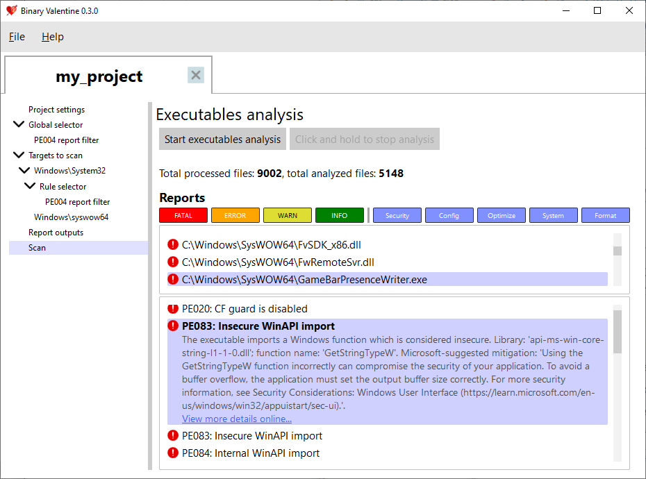

# Binary valentine
An open-source and free to use executable files static analyzer. Detects a range of various issues, which are usually out of reach of other tools (such as static code analysis).

# Why use it?
When developing desktop software, compilers and static code analysis tools only warn about issues with the code itself. However, when built into a binary, compiled code is surrounded by various structures which tell the operating system how to run the executable file. They also contain a lot of auxiliary information, such as version descriptions or digital signatures. These extra structures are not normally analyzed by any tools. Alas, this does not mean they can not contain any errors or security issues! And in fact, they often do. To reveal these issues and to get guidance on how to fix them, you can use tools like Binary Valentine.

Website: https://binary-valentine.com

Documentation: https://binary-valentine.com/docs



## Main features
* Provides both the compatible command line and the GUI executables. Also provides the project editor UI.
* Finds bugs, misconfigurations, format and security issues related to the executable format and not the code compiled into it. Suggests security hardening and optimization techniques.
* Supports flexible project configuration (file path, rule filters), which can be supplied as a separate file or in the command line.
* Supports several report formats (terminal output, plain text, SARIF, HTML).
* Supports both single executable rules and combined (cross-executable) rules.
* Easily to include in the SSDLC (Secure Software Development Lifecycle).
* Multithreaded and fast. With the fast SSD drive, scans the whole Windows 10 `System32` folder in 10-20 seconds.

## What Binary Valentine currently supports

### Portable Executable format
All Windows executable files use Portable Executable format. Some other systems like EFI and X-Box also use it. Binary Valentine detects the following issues:
* **Security issues**, such as absent hardening options (e.g. ASLR), insecure configurations (e.g. writable code sections), or usage of dangerous WinAPI functions.
* **Configuration issues**, for example, version information bugs, application icon and manifest issues.
* **Optimization issues**, which could be addressed to make the executable faster or smaller (e.g. profile-guided optimization usage).
* **System issues**, which are related to the operating system misuse, such as deprecated or internal WinAPI usage, system compatibility issues, and DPI awareness.
* **Format issues**, which are related to the PE format itself.

For Portable Executable, more than 190 rules are currently provided. Most rules are single-executable, but some of them do combined scans (e.g., version info cross-executable consistency check rules).

### Electron applications
For Electron applications, Binary Valentine provides a couple of rules which check that the Electron version used to build an application is recent and is not a preview.

### Flexible project configuration
An XML project file can be supplied to Binary Valentine, which would scan the project according to selected rules and filters. Binary Valentine provides an intuitive UI to create and edit projects files.

A project can contain one or more files or directories to scan (with optional regular expressions to filter path names). Each path or file can be configured with a separate set of applied rules, warning levels, and categories. Apart from that, XML projects can specify output format and execution options (e.g. thread count and max memory consumption limit).

In addition to project-based execution, Binary Valentine can be invoked by supplying all parameters to its command line.

### Industry standard output formats
Binary Valentine supports several output formats to ease integration with other systems. In addition to terminal, plain text, and HTML reports, it supports the [Static Analysis Results Interchange Format (SARIF) 2.1.0](https://docs.oasis-open.org/sarif/sarif/v2.1.0/sarif-v2.1.0.html), which is the industry standard format for the output of static analysis tools.

### Fluent UI
In addition to the command line, Binary Valentine provides a fully featured graphical user interface, which allows to perform executable files analysis in real time!
It is also a Binary Valentine project editor, allowing to create, edit, save and load projects without manually writing XML.

### Cross-platform
Binary Valentine can be built for a range of platforms with a set of C++20 compilers:
* Windows 10/11, MSVC 2022 (Visual Studio solution and CMake build are provided)
* Linux, GCC 13.0 (CMake build)
* Linux, Clang 16 (CMake build)

Windows 10/11 and modern Linux (kernel version 5.1 or newer with `io_uring` enabled) are supported as of today.

## Usage
For detailed command line documentation, see the website: https://binary-valentine.com/docs/usage/command-line

```plaintext
General options:
  -h [ --help ]                        Print options description
  -c [ --config ] arg                  Path to external XML configuration file.
                                       Can not be used with any other options.
  -r [ --root-path ] arg               Root path. This path will be used as a
                                       root for all relative paths specified.
                                       If absent, current directory will be
                                       used as a root path.
  --threads arg                        Analysis thread count. If absent,
                                       hardware core number will be used.
  --max-loaded-targets-size arg (=1G)  Max loaded targets size. If specified,
                                       the analyzer will preload as many
                                       targets to analyze as possible until
                                       their size in memory is less than the
                                       value specified.Should have a numeric
                                       value together with the suffix (B -
                                       bytes, K - kilobytes, M - megabytes, G -
                                       gigabytes), e.g. 2G for 2 gigabytes.
                                       Can not be used together with
                                       --max-concurrent-tasks.
                                       Default is 1G.
  --max-concurrent-tasks arg           Max concurrent analysis tasks. If
                                       specified, the analyzer will preload at
                                       most max-concurrent-tasks targets for
                                       analysis.
                                       Can not be used together with
                                       --max-loaded-targets-size.
Combined analysis options:
  --do-combined-analysis arg (=1)      Do combined analysis of all specified
                                       targets. Default is true.
Targets options:
  -t [ --target ] arg                  Target file or directory to analyze.
                                       Required.
  --recursive arg (=1)                 Scan and analyze the target directory
                                       recursively. Default is true.
  --include-regex arg                  Analyze only targets with full paths
                                       which match the provided ECMAScript
                                       regex.
  --exclude-regex arg                  Analyze only targets with full paths
                                       which do not match the provided
                                       ECMAScript regex.
Report options:
  --exclude-reports arg                Exclude reports with the IDs listed. Can
                                       not be used together with
                                       --include-reports.
  --include-reports arg                Include only reports with the IDs
                                       listed. Can not be used together with
                                       --exclude-reports.
  --list-reports                       List all supported reports with brief
                                       descriptions.
  --exclude-levels arg                 Exclude report levels (info, warning,
                                       error, critical).
  --exclude-categories arg             Exclude report categories (system,
                                       optimization, security, configuration,
                                       format).
  --with-progress                      Report verbose analysis progress
Output options:
  --silent                             Do not output analysis results to
                                       terminal.
  -S [ --sarif ] arg                   Path to save the output report in SARIF
                                       format.
  -T [ --text ] arg                    Path to save the output report in
                                       plaintext.
```
